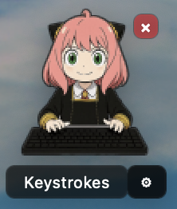

# typing-partner-app-mac
 
A friend that types while you type. Idea comes from Bongo Cat.

Mac overlay of the original application [bongocat-osu](https://github.com/kuroni/bongocat-osu) for Window/Linux.

# What's New
1. Support different scaling from 1x to 3x
2. Support keystroke count

## Prerequisites
To set up the environment, run the following commands:
```bash
conda create -n typingpartner python=3.8
conda activate typingpartner
pip install PyQt5 pyobjc
```

## Start the Application
To start the application, run:
```bash
python test.py
```

## Quit the Application
To quit the application, press `cmd+q` or click the `x` at the top of the floating window.

*Note: You may need to allow Terminal to control your computer by going to System Settings > Privacy & Security > Accessibility.*

## License
The cat image is from bongo.cat by Eric Huber (@Externalizable). Art courtesy of @StrayRogue. Meme by @DitzyFlama.

Thanks to the work done in [mac-typing-bongo-cat](https://github.com/111116/mac-typing-bongo-cat) and [mac-typing-cat](https://github.com/meiru-cam/mac-typing-cat).


## Special Thanks To
- GPT-4o & Sora for generating typing gif 
- Claude-3.5-sonnet for bug-fixing

Feel free to reach out with any questions or suggestions!

